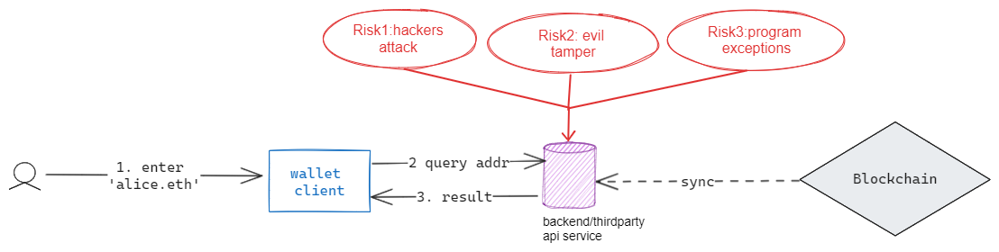
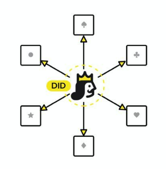
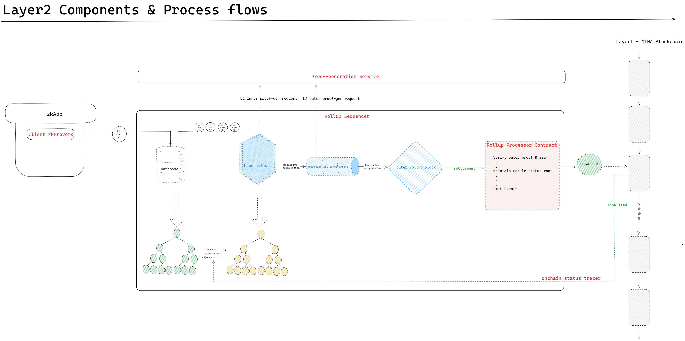
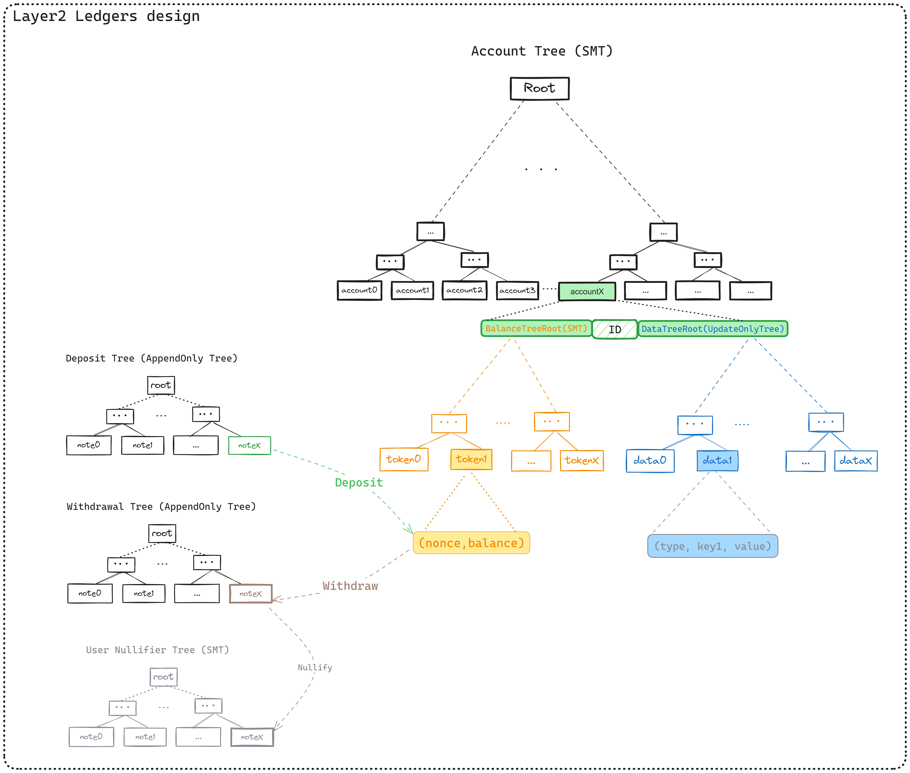
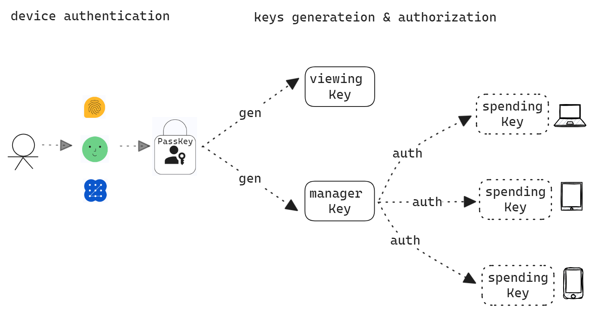

# zkCell -- An Instant Payment Network with Native ID for Web3 Mass-adoption

# Pitch about your project

zkCell is an Instant Payment Network with Protocol-Native ID. It not only scales layer1 upon the circulation of both MINA and Custom Tokens, but also allows you to build a globally verifiable onchain ID through provably aggregating mainstream blockchains' accounts and web2's PII. And you could manage asset directly by onchainID.

Besides, zkCell provides **a passwordless && mnemonic-free account solution** based on FIDO Webauthn protocol. **No need again to care about wallet-plugin installations, password/mnemonics backup and long address**.

Scalability & Convenience & Security, zkCell targets to break down barriers from Web2 to Web3, accelerates massive adoption of Web3.

# Describe the problem that your zkApp is solving

According to a market sizing [report](https://contenthub-static.crypto.com/wp_media/2024/01/Crypto-Market-Sizing-2023.pdf) from cryptocurrency exchange [Crypto.com](http://crypto.com/), more than half a billion people had become cryptocurrency users or owners by the end of 2023. This number is still very small compared to the ones of web2 companies. From the view of zkCell, to bring massive users to web3, the most important approach is to break down the barrier between web2 and web3, and let the common users seamlessly enter web3 from web2. Here are some challenges impacting user experience.

**<1> Scalability issue**

Based on the current Mina chain, we can foresee the following issues.&#x20;

*   Slow block confirmation && Increasing transaction flow

    Common users familiar to the smooth asset transfer journey on web2 world are always not used to web3's payment experience especially when they first enter.&#x20;

    Currently, though Mina's nominal block confirmation time is about 3 minutes, it's uncertain that each slot generate a block smoothly, which results in that total confirmation time of each block is over 5 minutes and further leads to bad user experience.

    Although recursive zkproof works well to make Mina ledger much slim, we could foresee the heavy/busy tx traffic as the number of users grows up and inevitable network congestion.

    Actually this is the common issue of most public blockchains. Take Ethereum as an example, Layer2 solutions are hot currently focusing on scalablility improvement, like Sidechains, Rollup, etc. All Layer2 solutions try to migrate as many tx as possible to  reduce tx traffic on mainnet(layer1).

*   Limited state’s capacity on each zkApp account

    Unlike solidity contract, Each zkApp account provides 8 fields of 32 bytes each of arbitrary storage. You are able to store anything here as long as it fits in the size provided. If the states are anticipated to be larger than this, then you need off-chain state instead.

    For larger data, we consider storing the root of a Merkle tree (or similar data structure) within your zkApp’s on-chain storage that references additional off-chain state stored elsewhere such as IPFS or Arweave.

    Here, However, our zkApp meets a new challenge -- **Data Race**! Concurrent updates (from numbers of users) upon the states based on the same merkle root must break data consistence. To guarantee data consistence, We need to solve the Race Condition. Mutex? Synchronization? Actions&Reducer? Or else? Up to your design.

    On one hand, if we overcome data race by Mutex or Synchronization, we meet another challenge -- **Poor User Experience**. Only one L1 tx could succeed each time, while other concurrent L1 txs (upon the same Merkle Root) all fails. Pls notice, each L1 tx costs, in spite of failure.

Obviously, to achieve the goal being an Instant Payment Network serving numbers of users on Mina chain,  we need a layer2 solution.

**<2> Tedious & troublesome steps to create/hold a crypto account**

The common operations for new users to firstly enter web3 or existing users to join new web3 activities (like airdrop, ICO, claim, etc.) happens at wallet clients, always with blow steps: *install wallet > create an account > backup password/mnemonics > deposit assets / transfer to target address*.

Additionally, there are more cases, like that there are numbers of new users with little knowledge on wallet plugins installation, like that some wallet plugins only support chrome explorer, like that users have to specially install mobile wallet apps due to most mainstream mobile explorers now don't 100% support plugins installations, etc.

Apparently, by comparison to web2 operations, the above progress is so tedious & troublesome. Besides, you might risk losing your crypto assets by improper operations, such as 'install wallet from fake(evil) source', 'exposing/losing password/mnemonics', etc. Without doubt, these increase mental burden and blocks the common users at the first step.

And one target of zkCell is *to wipe out the above tedious & troublesome steps to make crypto account walletplugin-independent, passwordless and mnemonics-free*. Meanwhile, other features like **multi-device support** and **account recovery**, etc, would also be supported to make your account management within zkCell really convenient.

**<3> Readability issues with on-chain addresses**

The wallet address of the blockchain is not only difficult to remember and readable, but also error-prone during use. When transferring, recharging and withdrawing assets generated by the blockchain, it is often a case of missing characters or typing wrong characters, resulting in transaction failure, or hitting the wrong account, resulting in asset losses, and theoretically unable to recover.

Replaces the wallet address with characters that are easy to remember by humans, which is a key step in the popularization of encryption. Users can choose a more user-friendly address to remember, making it easy to send and receive encrypted assets and reducing the probability of transferring to the wrong address when transferring money.

Within zkCell Network, we schedule to solve this issue thoroughly with an efficient approach -- We introduce onchain AccountID to allow users to own a unique AccountID. User could manage assets(deposit/transfer/receive) by directly ID rather than pure wallet address. **The AccountID solution works like ENS on ethereum, but it's protocol-native, i.e. zk-verifiable**.

**why Ens pattern is not 100% secure?**

Normally, Ens's mechanism is that we underlying maintain on smart contract a Bidirectional Mapping between *domain name* and *pure Address*. When users trigger a payment to specified ens' domain name, wallet client would trigger directly ens's resolver contract (*or delegate this operation to backend(or even third-party) api service*) for the mapping pure address of this domain name and go on completing normal payment journey. Thus users are able to just remember their own or receivers' ID and transfer crypto assets by ID directly & unmistakably, and thus to a certain extent avoiding transferring to wrong addresses as well as preventing hacker attacks during transfer(like clipboard attack cases).

It helps improve user's confidence during asset transfer, but it could not thoroughly solve them, since users has to unconditionally trust the wallet clients -- *Risk of Centralization*. The pic below describes the lack of this pattern:

</img>

*   Risk1: Hackers attack the API Service and tamper with the returned results;
*   Risk2: Internal personnel of the API Service commit wrongdoing and tamper with the returned results;
*   Risk3: Internal program exceptions in the API Service lead to incorrect results being returned;

**<4> ID middleware is necessary to Web3 world**

**The actual final real mission of Account-ID is to build a DID system in MINA world**, since we believe that as MINA's zkAPP ecosystem progresses to a certain point, it must also encounter situations where it is limited by 'Identity'(for the following reasons). Of course, DID is a big and complex concept, and we team schedules to take a small step forward with each future upgrades. And during this cohort, we schedule to enhance its features as **OnChain-ID** built into the account among zkCell Network.

*Why DID is so important to Web3(MINA)?*

Interactions in Web3 are now based on wallet addresses, but the cost of creating a new address is negligible, and few people are bound to an address. This leads to the fact that users can give up the "identity" represented by an address at any time, and can also create a large number of address "identities" at zero cost, which leads to a series of problems.

Regarding this, [<\<Decentralized Society: Finding Web3's Soul>>](https://papers.ssrn.com/sol3/papers.cfm?abstract_id=4105763) (authors: [Vitalik Buterin](https://papers.ssrn.com/sol3/cf_dev/AbsByAuth.cfm?per_id=3112539) & his partners) indicates that, Web3 currently has some limitations at the application layer, '*Because web3 lacks primitives to represent such social identity, it has become fundamentally dependent on the very centralized web2 structures it aims to transcend, replicating their limitations*', thus breaking the Web3 closed loop.

Typical examples are:

*   We cannot realize many common economic activities in reality, such as borrowing with insufficient collateral, since the current DeFi cannot construct the connection between the address and the "real person".
*   DAOs that expect to implement "one person, one vote" voting (with a token threshold) often have to rely on web2 infrastructure, such as social media profiles, to combat sybil attacks (where a large number of bots are programmed to behave like real people).
*   Some NFT projects claim to have been created by a well-known artist, but this creation cannot be directly verified on-chain. Users have to contact the artist through Web2 social media to verify the authenticity. If they cannot contact the artist or cannot be clarified in time, they are easy to be deceived.

Introducing an ID middleware helps manage and verify participants' identities, enabling a more secure and reliable interaction within the blockchain network while meeting specific compliance requirements and permission control needs. Apparently, at current (early) stage, web3 project teams might benefit more from (as well as being more urgent for) DID infrastructure than the common users.

The improvement of key infrastructures could promote ecological enrichment, and then attracts a large number of users. Therefore, the construction of Web3 native identity components is crucial to the further prosperity of Web3 world (MINA ecology).

# Describe your proposed solution

Regarding the listing Scalability issue above, we team specifically design **a zkRollup-style Layer2**, based on native ZK-capability on Mina. It is named as **zkCell Network**.

Firstly, zkCell is an layer2 based on **Account model**. Acting as an sub-ledger of Mina main ledger, zkCell migrate numbers of tx from mainnet into Layer2, but keep as safe as that on mainnet. Besides, zkCell internally batches numbers of L2 txs into one L1 tx on mainnet to make them finalized, which leads to much lower-cost of each L2 tx.&#x20;

zkCell supports **both MINA token and Custom Token**, and provides smooth journeys on deposit/transfer/withdrawal scenarios as well as **Escape Mechanism** for user to securely withdraw layer2 assets back to Layer1 when meeting urgency. 

A zkRollup Layer2 is the foundation for us to go further on below solutions:

**<1> Address the challenges of account creation and usage**

People are used to the convenience of sign-up and login in web2, so that they usually feel cumbersome in Web3 account operation. So our goal for zkCell Layer2 account is: **Make account operations as smooth as web2 while ensuring security**.

1.  **Eliminate wallet installation & Password & mnemonics**: Only your device and biometric information are required for easy access to your account. Wallet installation & password & mnemonics is history.
2.  **Non-custodian**: The full control over your private keys and funds is always kept by yourself. Without your biometric authentication, others will not be able to access your wallet.
3.  **Multi-device support**: Accounts can be synchronized on different devices after authorization. This is also an account backup.
4.  **Multiple mechanisms for Account Recovery** : Account recovery is straightforward using options such as social recovery, passkeys, and multiple devices, blockchain wallets, eliminating tedious mnemonic phrases.

**<2> Protocol-Native AccountID**

Unlike Ens, We move the mapping relationship between AccountID and Pure Address down to the protocol layer. This means that during the process of asset transfer, the mapping relationship between AccountID and Pure Address will undergo circuit verification. This helps mitigate the potential attack risks to AccountID in the asset management process mentioned earlier.

On the other hand, we have high expectations for the design of AccountID from the beginning -- **Globally Verifiable OnchainID Middleware** among Mina eco. We expect to allow users to aggregate by a provable approach both their web2 PII(*Personal Identified Info)* and mainstream blockchain's accounts. For examples, 
* as we know o1js from version-0.15.1 supports ECDSA signature verification, which provide users approach to provably aggregate their BTC/EVM chains' account addresses into our zkCell Account, based on which we could build web3 world's user portrait based on their activities among major chains. 
* When in the future o1js supports RSA signature verification, then we could leverage DKIM protocol to verifiably aggregate user's email address into zkCell Account.

 

The design of AccountID opens up possibilities for larger scenarios on the zkCell Network, such as 'off-chain identity authentication', 'on-chain reputation scoring', 'on-chain identity aggregation', 'compliance with regulatory requirements', and more. Examples are as follows:

1.  **On-chain Reputation Scoring**:

    Aggregate users' on-chain activities for analysis, calculate users' on-chain reputation scores using open-source and widely recognized reputation scoring algorithms. Based on this score, users can be hierarchically divided and filtered in web3 activities. For instance, accounts with low on-chain reputation scores may not be allowed to participate in current airdrops\&ICO activities, or cannot enjoy lower on-chain lending rates etc.

    Additionally, the on-chain reputation system gives users the opportunity to shape their own reputation, freeing them from dependence on centralized credit rating agencies. When users are dissatisfied with their credit score, on-chain reputation users can adjust their behavior transparently based on open-source reputation algorithms or submit additional data to improve their score.

2.  **Regulatory Compliance**:

    Privacy protection is a fundamental attribute of ZkCell Network, but the design of AccountID provides a way for regulatory compliance.

    Utilizing digital identity verification services, such as government agencies or authentication service providers, users can complete identity verification off-chain and then associate the obtained digital identity proof or authentication information with their AccountID. This approach protects user privacy while ensuring the authenticity of their identity.

# Architecture

## Provide technical detail for your zkApp design

The blow describes the design of layer2 first and L2 account maintenance later.

**<1>** **Layer2 Components section**

The pic below describe major layer2 components and how they cooperate with each other.

Let's make a brief description on all components:

*   **Client zkProvers**: They are circuits integrated into zkapps, working at client sides(e.g. explorers) for the zk proof generation during scenarios involving *Deposit/Transfer/Withdrawal/Account Maintenance.*
*   **Rollup Sequencer**: it's the core of layer2, in charge of receiving L2Tx from client sides and recursively compressing them into L2 Block. Besides, it maintains L2 ledger(merkle trees, described below).
*   **Proof Generation service**: a separate components intended for accelerating the zkproof generation during recursive compression
*   **Rollup Processor Contract**: works for the settlement of L2 state transition (i.e. L2 blocks).
*   **Onchain Status Tracker**: track the onchain state events and notify *Rollup Sequencer* to maintain L2 ledgers.

**<2> Layer2 Ledgers section**

The pic below is our design on Layer2 ledger.&#x20;

Totally, Layer2 ledger consists of trees of two parts, one is the common trees, and the other is user’s own trees.

*   **common trees (black ones)**:  Account Tree, Deposit Tree, Withdrawal Tree,&#x20;
*   **user’s own trees(yellow & blue & grey ones)**: Token-Balance Tree, User-Data Tree, User-Nullifier tree

Let's make a brief description on all trees:

*   **Account Tree**: SMT, recording all L2Account info. Each leaf stores an onchainID as well as  related user's own Token-Balance Tree root and User-Data Tree root.
*   **Deposit Tree**: Append-Only tree, working for deposit L1 Assets into L2
*   **Withdrawal Tree**: Append-Only tree, working for withdraw L2 assets back to L1
*   **User-Nullifier tree**: SMT, each user owns one, working for nullifying the specified L2 assets when withdrawal completes to avoid double spending.
*   **Token-Balance Tree**: SMT, each user owns one, recording user's own deposited token assets(MINA & Custom Token, based on Account Model, wherein TokenID as Leaf Index).
*   **User-Data Tree**: Standard Merkle Tree, each user owns one, recording user's own data, like emial, btc/evm chains' account, or Account Keys described below.

**<3> Account Creation & Backup & Recovery section**

We design 'Multi-Level Keys' to support '**Eliminate wallet installation & Password & mnemonics**'. The pic below is the design of the keys hierarchy.

*   '**Account Viewing Key**' is used for L2Tx encryption & decryption to later rebuild all L2tx history at new device.
*   '**Spending Key**' is used for asset management(transfer/withdraw). Normally 'one device, one spending key'.
*   '**Manager Key**' is a new key at this upgrade, which is used for authorizing 'spending keys' for different devices.

All the keys will be recorded on chain under your L2 account(at *User-Data Tree*, through L2Tx). 

**1) how to implement passwordless & mnemonics-free account**

As a background, let's take a look at the brief intro on '[WebAuthn](https://webauthn.io/)' and '[PassKey](https://developers.google.com/identity/passkeys)'.

*   'WebAuthn is an open standard developed by W3C for implementing modern, secure, and user-friendly authentication. It utilizes methods such as public key encryption, biometrics, and hardware keys to replace traditional usernames and passwords, offering a more robust and predictable authentication mechanism, thereby enhancing the security of internet services.'
*   'Passkeys are a safer and easier alternative to passwords. With passkeys, users can sign in to apps and websites with a biometric sensor (such as a fingerprint or facial recognition), PIN, or pattern, freeing them from having to remember and manage passwords.'

Leveraging ‘**FIDO WebAuth Protocol(PassKey)**’ + '**Deterministic Signature**', we could always generate the same (unique) 'Manager Key' and 'Account Viewing Key' at your device (*high-level process is that, we first conduct additional calculations in a browser environment to derive a stable entropy value from the unchanging part of the r1 algorithm. Then based on this entropy(as seed), we could derive final stable ’ManagerKey’/’ViewKey’ aligning with MINA private key standard.*).   That means you could access(signup & signin) ZkCell L2 Account on your device directly by your device's screen lock such as a fingerprint sensor, facial recognition or PIN.

Mature WebAuth(PassKey) Tech make you no worry about exposure & loss of your device PassKey(even if you lose your devices. *will describe why below*), and thus no worry about you lost your 'Manager Key' and 'Account Viewing Key'. **This further means you No need again to care about wallet-plugin installations, password/mnemonics backup.**

Note: *Both 'Manager Key' and 'Account Viewing Key' are only generated in memory each time you need them and will be purged from memory after usage. This means the risk of exposure would be very low. Luckily,  this risk CAN be eliminated 100% when o1js supports secp256r1 curve of PassKey in the future, Since user could directly manage assets by verifying within circuits the signatures generated from PassKey.*

You could see that the full control over your private keys and funds is always kept by yourself (**Non-custodian**). Without your biometric authentication, others will not be able to access your L2 account.  

**Why no worry about losing device and thus results in losing Passkey and Layer2 account?**

PassKey is new, but support for it is currently rolling out across major operating systems and browsers. Besides, Passkeys can be synchronized across devices in the same ecosystem. For examples,
  1) Chrome on Android OS 9+ supports passkeys. Passkeys generated in Chrome on Android are stored in the Google Password Manager. These passkeys are available on all other Android devices as long as Google Password Manager is available and the same user’s Google Account is signed in.\
  2) Chrome on iOS16, iPadOS16, and macOS13.5+ can use iCloud Keychain to store passkeys. Passkeys in iCloud Keychain are synchronized across the user’s Apple devices and can be used by other browsers and apps.

Apparently Newer devices and systems offer more comprehensive passkey support. The above means Even if you lose your devices, you could conveniently find back your PassKey by iCloud Account(for Apple devices) or Google Account and then restore your Layer2 Account at any time at new devices.

But Since PassKey is new these years, different devices and operating systems are in fact at different stages of passkey support. For example, Chrome on Windows stores passkeys in Windows Hello, which doesn’t synchronize them to other devices now.
Regarding these cases, if user lose the devices, we also provide other mechnisms for users to recover account, such as Social Revovery.

*Tips: Here are some materials for brief introductions on device support of PassKey.*
    * https://passkeys.dev/device-support
    * https://caniuse.com/?search=Passkey

 

**2) how to support Multi-Devices synchronization**

'Multi-Device support' means you could leverage 'Manger Key' to authorize a new-generated 'Spending key' at new device. Our Account solution provide secure approach for users to complete the progress, high-level steps as below:

*   enter zkapp at a new device, and generate a new 'Spending Key' (encrypted & stored in explorer storage)
*   sync encrypted 'Account Viewing Key' to the new device and then decrypt it by inputing password
*   sync the new encrypted 'Spending Key' to original device and authorize through L2Tx the new 'Spending Key' by 'Manger Key'.

In additions, if you suspect specified 'Spending key' is exposed, we provide approaches to invalidate it to avoid asset loss.  

**3) how to implement Account Recovery**

We provide a series of mechinsm for Account Recovery, such as social recovery(based on Emergency contact mechanism), passkeys, and multiple devices, eliminating tedious mnemonic phrases. 

# Go-to-market strategy

## Share your go-to-market strategy, which includes:

The main goal of zkCell Network is: break down the barriers between web2 & web3, and let people seamlessly switch to web3. 

In 3 months, We expect user could enjoy *convenient& innovative account management solution* within ZkCell Network.

Strategy：

**Phase1 (in 3 months):**

* _Begin from Developer Community_: invite technical community members as seed users for a small-range test (from testnet to mainnet),

**Phase2 (in 6months):**

* _Education and Training_: Create tutorials, videos and guides on all user journeys like from *Account Creation&Usage&Recovery* to asset management of non-compromised privacy within ZkCell。

* _Social media Promotion_: Use social media platforms(discord/twitter mainly) for promotion, interact with the cryptocurrency community, and share the features and advantages of ZkCell. Work with industry partners to expand the user base.

* _Community Engagement_: Build an active community that facilitates communication and collaboration among users by hosting online or offline events, forums, and social media interactions.

In addition, as a Layer2, in the future, we may consider **issuing tokens for community airdrops and rewards** to motivate users to stay active, participate in the community, and recommend new users.

## What does success look like in terms of user adoption in 6 months from now? Please be as specific as possible.

What we think 'success' look like in terms of user adoption in 6 months is mainly based on the number of active users.

We think the below metrics are important:
1) the number of twitter followers exceeds 3,000
2) the number of account creation exceeds 1000
3) the number of github stars: exceeds 30
4) the number of github issues: exceeds 10
5) hot community feedbacks: 80%+ users gives us a positive rating during our surveys, while 30%+ users could give us detailed feedbacks.

# Commercial vision

## Share your thoughts on generating revenue over a longer time horizon (greater than 6 months)

As a layer2, our revenue mainly depends on the number of active users.

Our Profit Models:

1) Account creation fee
2) Fee income

    The ZK-Rollup network can collect fees paid by users when they execute transactions.

3) Value-added services

    * case1 - computing outsourcing services: since circuit-compile & witness-calc & proof-gen usually costs much resources(time/cpu/memory) at user clients, 'computing outsourcing services' are provided for a fee for 'Layer2 Tx without privacy requirements'.

    * case2 - Data aggregation and analysis services: Through the deep processing of the public data of layer2 users, high value analysis charts and reports are extracted, and the fees are generated. Examples include aggregated reports of on-chain activity for a specific user,

    * case3 - Establish an on-chain reputation scoring system and provide paid-query services

4) Governance equity

    The ZkCell network may consider introducing governance tokens in the future, where holders (founder team and community members) can participate in the decision-making process of the network, and these participations may bring certain gains.

In the future (longer time horizon), as the number of active users grows up within ZkCell Network, we believe Revenue channels will be more diversified.

## What is your long-term vision for this project if your proposal is funded? What is your dream scenario for how this project could evolve?

dddddd
dddddd
dddddd
dddddd

# Budget and milestones

## Standard Budget in MINA

85000

## Standard Scope

(Assuming a dollar denominated value of $1 per MINA (at time of proposal))

The whole design of ZkCell was almost completed. Within 3 months zkIgnite corhort3, we team spends the budget mainly on Cloud Infra && Design Detail Improvement && Software upgrade && Team member expansion && Marketing Costs Budgeting .

**<1> Cloud Infra costs: 20000 MINA**  (≈3384.28U/month * 6 month)

Basically, in high-level overview, as a zkRollup-layer2, ZkCell mainly consists of 3 core components: Sequencer, Prover and Indexer.

Considering the impending upgrade of MINA main Network, to ensure the stability of ZkCell Network running on the main network, we consider adopting AWS cloud hosting service. Here's our rough minimum plan:

* *Sequencer server*: at least 16c,32G memory, at least 2 instance(considerring load balance,etc), 
* *Prover server*: at least 32c,256G memory, at least 2 instance,
* *Indexer server*: at least 8c,64G memory, at least 2 instance, 

Totally，almost 3384.28U/month for Cloud Infra cost (seen at attached pic: [server-cloud-price-estimation.png](https://zkignite.minaprotocol.com/media/download/e55c1b1b963d13281287ff6bd8bd5c18))。

In addition, given the emergency scaling of unexpected traffic spikes and continued operations beyond zkIgnite, we expect an additional 3 months of support beyond zkIgnite.

**<2> Design detail improvement && Software development: 50000 MINA**

We schedule to carry out an UI/UX && node service coverring features below:

1) Implement Layer2 Ledger 

2) Integrate WebAuth(PassKey) for new Account Management solution 

3) Protocol-Native AccountID  

4) Integrate ETH account 

To ensure quality/ontime delivery, We team need consider employing two contractors: UI Designer and Backend Engineer.

So the rough estimation on 3month(about 67 work days) salary is almost 50000U(≈150U/day * 5member * 67days)

**<3> Marketing Costs Budgeting:    15000MINA**

After deployment on MainNet, We need budgets on Community Marketing, such as Layer2Tx Fee Delegation, Activity Incentive, Promotion Incentives,  Community Education, etc.

### Standard Scope Milestones

Milestones in three months:

Milestone1:  Implement Public Ledger   (4 week)

Milestone2: Integrate WebAuth(PassKey) for new Account Management solution (4 week)

Milestone3: Protocol-Native AccountID  (2 week)

Milestone4: Integrate ETH account  (1 week)

Milestone5: Integration Test & BugFix (1 week)

## Advanced Budget in MINA

108000

## Advanced Scope

(Assuming a dollar denominated value of $1 per MINA (at time of proposal))

The whole design of ZkCell was almost completed. Within 3 months zkIgnite corhort3, we team spends the budget mainly on design detail improvement && software upgrade && cloud infra && Team member expansion.

**Tips: Extending Standard Milestone, in Advanced milestone we mainly incrementally build the Layer2 Network Explorer for ZkCell Network**.

<1> Cloud Infra costs: 24500 MINA  (≈4061U/month * 6 month)

Basically, in high-level overview, as a zkRollup-layer2, ZkCell mainly consists of 4 core components:* Sequencer, Prover, Indexer, and Network Explorer.

Considering the impending upgrade of MINA main Network, to ensure the stability of ZkCell Network running on the main network, we consider adopting AWS cloud hosting service. Here's our rough minimum plan:

* Sequencer server: at least 16c,32G memory, at least 2 instance(considerring load balance,etc), 

* Prover server: at least 32c,256G memory, at least 2 instance, 

* Indexer server: at least 8c,64G memory, at least 2 instance,

* Network Explorer: at least 16c,32G memory, at least 2 instance (price is roughly like Sequencer server's).

Totally，almost 4061U/month for Cloud Infra cost (seen at attached pic: [anomix-cloud-price-estimation.png](https://zkignite.minaprotocol.com/media/download/e55c1b1b963d13281287ff6bd8bd5c18))。

In addition, given the emergency scaling of unexpected traffic spikes and continued operations beyond zkIgnite, we expect an additional 3 months of support beyond zkIgnite.

**<2> Design detail improvement && Software development: 68500 MINA**

We schedule to carry out an UI/UX && node service coverring features below:

1) Implement Layer2 Ledger 

2) Integrate WebAuth(PassKey) for new Account Management solution 

3) Protocol-Native AccountID  

4) Integrate ETH account 

5) __Network Explorer__

To ensure quality&ontime delivery, We team need consider employing 3 contractors: 1 UI Designer and 2 Backend Engineer. So the rough estimation on 3month(about 67 work days) salary is almost 68500U(≈170U/day * 6member * 67days)

**<3> Marketing Costs Budgeting    15000MINA**

After deployment on MainNet, we need budgets on Community Marketing, such as Layer2Tx Fee Delegation, Activity Incentive, Promotion Incentives,  Community Education, etc.

### Advanced Scope Milestones

Milestones in three months:

Milestone1: Implement Public Ledger   (3 week)

Milestone2: Integrate WebAuth(PassKey) for new Account Management solution (3 week)

Milestone3: Protocol-Native AccountID  (2 week)

Milestone4: Integrate ETH account  (1 week)

Milestone5: Network Explorer (2 week)

Milestone6: Integration Test & BugFix (1 week)

# Risks & Dependencies

## What risks or dependencies do you foresee with building and launching this application?

* Risks from Performance

    As a zkRollup layer2 consisting of multiple merkle trees, the complexity of ZkCell might lead to significant circuit size. This might impact the performance of the ‘compiling’ section and ‘proof-generation’ section. We team raises several solutions to improve the performance, such as leveraging high-performance cloud infra,  separating a service intended for proof generation, optimize circuit design to decrease extra constraints, etc.

    Though this might matter, the risk just slow down the performance and does NOT block us to complete the project.

* Risks from design

    Although we team has completed the whole design, some details might be adjusted to perform better. This results in extra efforts.

* Risks from potential bugs of o1js

    The circuits in ZkCell covers most features of o1js. Potential bugs of o1jsimpact our project. But with gradually stabilized features of o1js as well as the supports from Mina community(in discord channels, etc.), we estimate this risk could be reduced gradually.

* Risks from Mina network issues

    Potential network issues also directly blocks our development and testing plans. Fortunately, this risk is not high because network issues impact so much around that maintainers quickly take actions to fix/recover it.

# Team Info

This section provides details about the proposal team.

### Proposer Github

<https://github.com/coldstar1993>

### Proposer Experience

I am an Full-stack Engineer with 7years’ experience in web3, mainly focusing on Bitcoin, Ethereum and Mina. And participated in Mina community from 2020.

My resume:

(1) Team Leader of Anomix Network

    • **Funded Project at Mina ZkIgnite Cohort1**

    • In charge of Design upon Archetecture, UI, etc.

    • In charge of team management and project delivery

(2) co-Creator of **o1js-merkle** library - Merkle Trees for o1js (membership / non-membership merkle witness)

    https://github.com/plus3-labs/o1js-merkle

(3) **Mentor of zkIgnite cohort 2**

    • Mentor of ‘[Tokenizk.finance](https://tokenizk.finance/)’ team and ‘Privacy Token On Mina’ team

    • Provide guidance on technical design and issue solutions for projects

(4) **The First translator of \<Foundry Book>** of Chinese version

    • recognized & forked by a famous Chinese blockchain community -- lbc-team

    • As Repo Admin of the book: https://github.com/lbc-team/foundry-book-in-chinese

(5) **Active Grantee** in Mina ecology

    • **Navigators badge holder**
    • zkApp E2E Testing Program
    • zkApp Builders Program-Cohort1
    • zkIgnite cohort0
    • zk-peer-reviewer at 2022
    • zkapp-beta-tester
    • zkApps bootcamp at 2021

### Team Members

**Comdex#3801**

Github: <https://github.com/Comdex/>

Mina Genesis founding member, 

Active in community with several contributions:

*   co-Creator of **o1js-merkle** library - Merkle Trees for o1js (membership / non-membership merkle witness)

    https://github.com/plus3-labs/o1js-merkle

*   Developer of [snarky-smt](http://comdex.github.io/snarky-smt/) -- Merkle Tree for SnarkyJS with Pluggable Storage;
*   Developer of [WoKey](https://www.wokey.io/) -- The **First** cold wallet app within Mina community;
*   Developer of [Nft-zkapp](https://github.com/Comdex/nft-zkapp) -- a simple private NFT (of POC) based on mina zkApp;
*   Developer of [ZK-MultiSig](https://multisig.zkapps.xyz/) -- a zk multi-sig wallet to connect to Mina zkApps, rank: high-quality zkApp;

Besides, selected as a member of many technical activities, such as zkApps-bootcamp-2021, zkApp Builders Program-Cohort 1, ZK-peer-reviewer at 2022 and zkapp-beta-tester. Awarded 'HighQuality zkApp' within zkIgnite-cohort0 , **Navigators badge holder** and  an active grantee, etc.

# Cohort 2 Participation

No
