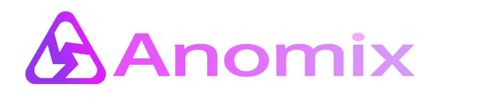

# Description
Anomix Network, formerly called 'Shadow' in zkApp Builders Program 1,  is a zk-zkRollup layer2 solution on Mina, focusing on Privacy&Scalablility. It grows up alongside with the upgrade of o1js.

    Website: https://www.anomix.xyz/

    Twitter: https://twitter.com/Anomix_ZK/

Basically, On Anomix Network, you could make your L2 account anonymous and your on-chain operations private(invisible&untraceable). Besides, As a layer2, Anomix Network batches L2 txs to make fee apportioned(much lower cost), and furthermore it’s easy to build private defi/nft/DID, etc.

Within zkIgnite cohort1, We will provide a zkApp, named as Ano-Cash, as the officially first entry of Anomix Network.

NOTE: Thanks to ZKRollup's predecessors such as zkSync, Aztec, etc, and ZK Layer1 such as Mina, IRon Fish, with reference on design documentation of them, this design could be completed.

# Getting started

**TODO we need to improve the doc to newer version corresponding to [circuit](../packages/circuits/)**

## Summary
- [Intro](./intro.md)

## Architecture
- [Architecture & Flows](./architecture_and_flow.md)
- [Cryptographic Primitives](./primitives.md)
- [Notes & Nullifiers](./notes_and_nullifiers.md)
- [Anomix-account-creation-journey](./pic/Anomix-account-creation-journey.png)
- [Anomix-account-registration-journey](./pic/Anomix-account-registration-journey.png)
- [Anomix-account-update-recovery-journey](./pic/Anomix-account-update-recovery-journey.png)
- [Anomix-account-migration-journey](./pic/Anomix-account-migration-journey.png)
- [Anomix-assets-deposit-journey](./pic/Anomix-assets-deposit-journey.png)
- [Anomix-assets-transfer-withdrawal-journey](./pic/Anomix-assets-transfer-withdrawal-journey.png)

## Client Circuits
- **Both 'Account Circuit' and 'Funding Operation Circuit' are in fact merged into One circuit. But split them here for clear explanation.**
- Account Circuit
  - [Account Creation](./account_circuit_creation.md)
  - [Account Registration](./account_circuit_registration.md)
  - [Account Update&Recovery](./account_circuit_update_recovery.md)
  - [Account Migration](./account_circuit_migration.md)

- [Funding Operation Circuit](./join_split_circuit.md)
  - [Deposit](./join_split_circuit.md#deposit-funds-from-l1)
  - [Transfer](./join_split_circuit.md#transfer-funds-within-l2)
  - [Withdraw](./join_split_circuit.md#withdraw-funds-to-l1)

- [Anatomy-of-A-L2-User-Tx](./anatomy_of_a_L2_user_tx.md)

## Rollup Circuits
- [Rollup Circuit](./rollup_circuit.md)
  - [innerRollupZkProgram_design](./rollup_circuit.md#inner-rollup-zkprogram)
  - [RollupMergeZkProgram_design.md](./rollup_circuit.md#outer-rollup-zkprogram)

## Contracts
- [Rollup Contract](./rollup_contract.md)

## SDK
- [SDK](./sdk.md)

## Potential Issues
- [potential issues](./potential_issues.md)
