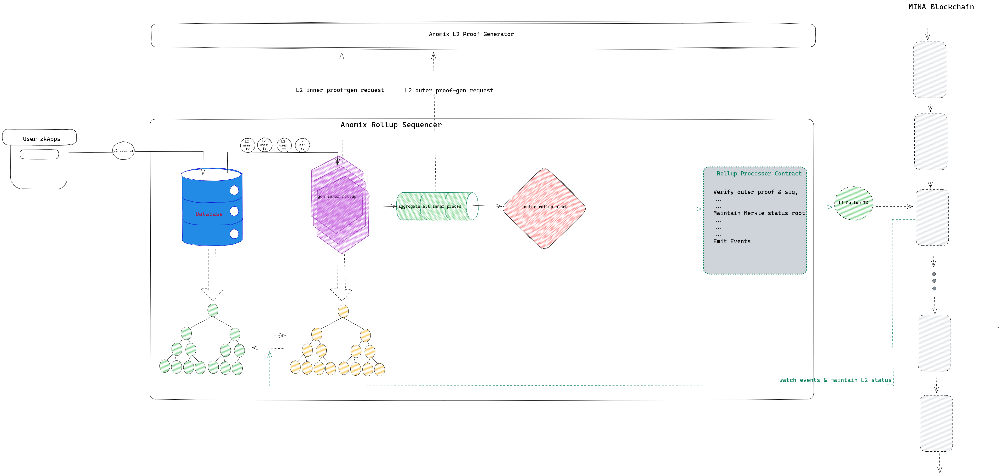

# Architecture
Anomix Network is a layer2 Of Mina, based on UTXO account model, with capabilities to make your fund operations private, anonymous and un-tracable.

Within Anomix Network, you will get a totally new L2 account derived from L1 account, and any one could not link L2 account with L1 account unless it obtains the private key of L1 account, meaning any of your operations in Anomix Network could neither be linked with L1 account.

With aid of Anomix Network, you could benefit from `anonymous & private` fund operations, such as `depositing fund from L1, withdrawing fund to L1, transferring fund to any one within L2`, etc. No body could trace your funds circulation, because all sensitive parts about your operations happen on your local devices (leveraging zero knowledge proof) and all your status info are also stored within L2 network under solid encryption.

Based on UTXO account model, all your behaviors including account management & fund operations are via `Note` pattern within Anomix Network. 
* account management is via `account notes`
* fund operations are via `value notes`

Go through this documentation for More details!

## Network Components & Roles
Anomix Network contains several major components described as belows:

`User-Oriented zkApps`
* integrated with `Anomix SDK` to interact with Anomix Network
* calculate L2 fund operations zkproof and send as a L2 tx to `Anomix Sequencer`
  * Anomix L2 User Tx Circuit

`Anomix Sequencer`
* recieve, validate and store L2 User Tx (normally from `User-Oriented zkApps`)
* calculate recursive zkProof for latest L2 User Tx
  * Anomix L2 Inner Rollup Circuit
  * Anomix L2 Outer Rollup Circuit
* publish rollup block within a L1 tx to `Anomix Rollup Processor Contract`
* maintain L2 status(i.e. each merkle trees)
* listen for onchain events, .etc.

`Anomix Rollup Processor Contract`
* deployed on Mina L1
* verify each rollup block associated with its zk-Proof from `Anomix Sequencer`
* maintain the merkle tree root of the whole Anomix Network

Besides, Anomix Network provide an SDK for any zkApps to make a integration:
* `Anomix SDK`

And, to improve the efficiency of proof generation at `User zkApps` and `Anomix Sequencer`, we design a seperated standalone zkproof-generating service:
* `Anomix Proof Generator`
  * recieve zkproof generating requests from `User zkApps` and `Anomix Sequencer` and return proof result

Furthermore, Anomix Network has its own L2 explorer for user to take a high-level or detailed look at L2 status.
* `Anomix L2 Explorer`

## Storage Layers
All L2 tx(normally from `User-Oriented zkApps`) are persisted into Database by `Anomix Sequencer` after basical validation.

When Anomix Network starts, `Anomix Sequencer` constructs Merkle Trees based on all confirmed L2 tx set, etc. These Merkle trees represent the Latest status of the whole L2 Network.
* data tree
  * account note commitment
  * value note commitment
* nullifier tree
  * alias nullifier
  * account key nullifier
  * value note nullifier
* root tree
  * records all historical root of data tree.

_Note:_ All leaf nodes is based on Hash of plain txt instead of encrypted notes.

## Overview of Rollup Processing

The pic briefly demonstrates the overview of components & roles inside Anomix Network, as well as their cooperations. Now, let us make a brief description on the total flow

* Any zkApps integrated with anomix sdk could easily leverage anonymous & private fund operations from anomix network. As pic, when user journey arrives at funds operations(like pay), user locally construct a L2 user tx with zkproof and send it to `Anomix Sequencer`
* `Anomix Sequencer` is responsible for serveral tasks
  * recieve L2 user tx, and make a basical check on tx format & field validity, and then store it into database.
  * a rollup pipeline would be started up in time to retrieve latest pending L2 tx from DB, divide them into pieces of given amount each, and make an proof aggregation for L2 user tx in each piece. we call this progress 'inner rollup proof generation' (leverage calculation service from the standalone `Anomix Proof Generator`).
  * serveral inner rollup proof are further integrated into the final 'outer rollup proof' (leverage calculation service from the standalone `Anomix Proof Generator`). 
  * invoke `Anomix Rollup Processor Contract` to make final circuit witness and generate final proof, then construct the final L1 tx and send it to Mina Network.
  * `Anomix Sequencer` always listens for the L1 tx confirmation and maintain the Merkle tree root.

# Flows

## Account Creation & Registration & Update & Migration & Recovery

Within Anomix Network, L2 Account is totally different from L1 account. In general, Anomix account consists of three parts: 
* a unique account alias
  * beside traditional wallet address, within Anomix Network, people could send funds to any one via target's account alias. 
* viewing key pairs
  * for encryption&decryption of notes, like account notes, value notes, note nullifiers.
* spending key pairs
  * to sign L2 tx for spending value notes.

When you first create the Anomix account, it just consists of viewing key pairs, in which the public key for note encryption and the private key for both note decryption and note spending.

Further, You had better make an account registration, meaning registering a unique account alias as further recipient name, as well as registering serveral spending key pairs for `more convinient & secure` note spending across multiple devices.

### Account Creation
As a new user entering Anomix Network, you need to create your own `Account`. Anomix account is a key pair derived uniquely from your L1 wallet, making usage of different cryptographic algorithm from Mina account generation. Each L1 wallet could only generate one corresponding Anomix L2 account. 

Brief progress of L2 account generation:
* Anomix client asks your explorer wallet extension like `Auro wallet`, for the signature of a specific data piece.
* Anomix client generate your L2 account's private key from the signature, then generate your L2 account's public key. The key pairs are the `viewing keys` of your L2 account.

Then Your own Anomix L2 account is born officially! 

Apparently, In general you `never` need to specially-carefully-privately keep L2 account's private key, Since it could be generated any time with your L1 account any where.

NOTE: Your current account has not been registered on *Anomix Storage*. But you are able to recieve & transfer & withdraw L2 Assets now!! However, we strongly recommend u to go ahead on *Account Registration* to enjoy further convenience & security!

### Account Registration
Account registration consists of three parts:
* account alias
* account viewing keypair
* account spending keypairs

This section helps register officially your account info onto _Anomix Storage_.

After you create an L2 account from L1 account, yet You don't have a unique account alias which acts as your ID within Anomix Network. Any one had better take an account alias for more clear & convinient recepient within payment behaviors.

Along with account alias, you will register at least one spending key pair. Although your viewing key pair is able to both encrypt & decrypt notes and spend value notes, but it's more secure for you to have serveral spending keys only responsible for value note spending, then make viewing key focus on note encryption & decryption.

Account spending key pairs are normally also derived from L1 wallet via the signature of a special data piece.

_NOTE:_ You could also generate _Account spending key pairs_ by randomness source, rather than by L1 account. **But you yourself must keep the private key carefully!**

_NOTE:_ It's highly suggested that senders specify recipients have to spend the recieved funds by specified _Account spending key_. Although this is not enforced by protocol.

_Tips:_ We highly recommend you to take actions to transfer all L2 assets received before _Account Registration_.

### Account Update
Anomix protocol does NOT limit the number of *spending key* under an account. Actually, We recommend users to register serveral *spending keys* for more convenience upon scenarios like 'one key one device'.

At this section, you could register two spending keys each time in one operation.

### Account Migration
When you carelessly expose your *viewing private key* or one of *spending private keys*, or you wanna re-arrange your L2 account, then you need to migrate your account notes and value notes to new viewing keys and spending keys.

### Account Recovery
Anomix protocal naturally supports **Social Recovery** of accounts.

As described in the _Account Update_ section, you need a signature of the existing spending key, when adding a new spending key for the account.

However, in the worst case, you may lose all the spending_ private_key. To recover the account in this case, you gotta register an spending_public_key from a trusted third party before losing all your keys, and then apply for its spending_private_key to help us register your own new spending_public_key。

A trusted third party can be our friends, family members, trusted institutions, etc. So we call it **Social Recovery** of accounts.

We don't have to worry about 'trusted third party' suddenly becomes 'untrustworthy', Because they don't control our account_ public_ key。

tips: You can easily see that **Account Recovery** is a general journey of **Account Update**.

## Deposit funds from L1
All funds within Anomix Network are originally sourced from L1 Mina account. You are supposed to make a fund deposit from L1 wallet balance, then you could quickly get corresponding L2 value notes storing funds!

_NOTE:_ Powered by zero knowledge proof and encryption algorithm, no worry about the possibility of linking L1 deposit address and L2 value notes! 

## Transfer funds within L2
All funds are storing as value notes within Anomix Network. With knowledge of UTXO model, fund transfer aligns with `Joint-Split` pattern. That means, if no one of your value notes is equal to or greater than the amount you plan to transfer, you would first aggregate (`Joint`) multiple value notes to make their sum equal enough or greater than. Then if their sum is greater than payment amount, you also need to `Split` a part (as a new value note) for your `change`(找零).

## Withdraw funds to L1
Withdraw fund to L1 also aligns with `Joint-Split` pattern. But the payment fund is transfer out of Anomix Network into Mina L1, and your `change` stays still as a new value note within L2.

_NOTE:_ Based on zero knowledge power and encryption algorithm, no worry about the possibility of linking L2 value notes and L1 fund-recieving address! 

## ESCAPE Window
As a Layer2 for storing users' assets, we focus on asset security much! Even in extreme cases.

As description above, Anomix network protects users' (&assets') privacy by crytographical manner like zkp and encryption. No one could trace & steal users' assets unless asset owner carefully exposes account keys.

`Anomix Sequencer` acts as the coordinator for the whole network, without which all L2 txs could not be bundled and finalized. However, as you can see, at the current stage, it is a 'CENTRALIZED' role. What if it breaks down for a long time? What if it becomes remiss? 

Or even what if serious Bugs or Vulnerabilities on protocal? 

To avoid 'single point of failure' and 'gross dereliction of duty' from `Anomix Sequencer` or 'protocal FLAW', Anomix provide a window for users to take their own assets back quickly!

# an L2 user Tx Journey
// TODO